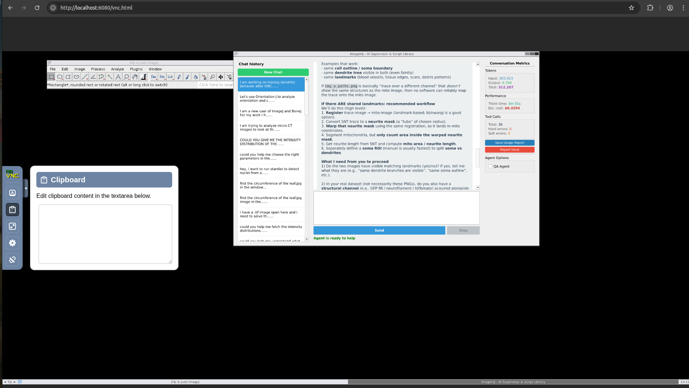

# Interface & How the System Works

## The browser interface

When you open `http://localhost:6080/vnc.html` you see a virtual desktop rendered via noVNC. It contains two main areas:

- the ImagentJ chat interface (conversation history, new chat button, usage meter)
- the full Fiji/ImageJ application running in the virtual desktop

Scaling is set to "Local Scaling" by default so the desktop fits your browser window.

### Chat panel controls

| Control | Description |
|---------|-------------|
| **Send / Enter** | Submit your message to the agent. |
| **Stop** | Requests the agent to stop after the current tool call completes. The agent finishes its in-progress step first — it does not cut off mid-execution. Use this if the agent is heading in the wrong direction or is taking too long. |
| **QA Agent** (checkbox) | Enables the QA Reporter agent, which runs a full audit at the end of the workflow and generates `QA_Checklist_Report.md`. **Off by default** — enabling it adds one extra LLM call per completed project and increases cost. Toggle it before sending your first message; the setting cannot be changed while the agent is running. |
| **Save Usage Report** | Saves a JSON summary of token usage and estimated cost for the current conversation to a file of your choice. |
| **Report Issue** | Opens a dialog to describe a problem and send a report to the developers (see [Data & Reports](04_data_history_and_reports.md)). |

---

## Copying and pasting text (VNC clipboard)

The noVNC toolbar on the left edge of the browser window contains a clipboard tool that bridges your local clipboard with the virtual desktop.

To paste text into Fiji (e.g. a file path):
1. Click the clipboard icon in the noVNC sidebar.
2. Paste your text into the clipboard panel.
3. Click inside the Fiji window and paste normally (Ctrl+V / Cmd+V).

To copy text out of Fiji, select it in the virtual desktop, then open the clipboard panel to retrieve it.

---

## Agent architecture

ImagentJ uses a **supervisor + specialist** model. The supervisor receives your request, orchestrates the pipeline, and calls specialists as tools. You never address specialists directly.

| Agent | Model | Role |
|-------|-------|------|
| **Supervisor** | GPT-5.2 (low reasoning) | Plans the workflow, maintains project state, calls specialists and tools, synthesises results. |
| **Plugin Manager** | GPT-5.2 | Finds the best Fiji plugin for a task by reading plugin skill descriptions; checks whether it is installed and installs it if needed. Called automatically in the planning phase. |
| **ImageJ Coder** | GPT-5.3-codex | Writes production-ready Groovy/ImageJ macro scripts using plugin skill documentation. |
| **ImageJ Debugger** | GPT-5.3-codex | Diagnoses and repairs failing scripts by reading the ImageJ log and inspecting exception stack traces. |
| **Python Data Analyst** | GPT-5.2 | Runs Python code for statistical analysis (scipy, pandas) and publication-quality plots (matplotlib). |
| **QA Reporter** | GPT-4o-mini | Audits the completed project folder against workflow and image-publishing standards; generates a `QA_Checklist_Report.md`. Optional — enabled per session. |

The supervisor follows a structured pipeline: gather requirements → select plugin → plan → set up workspace → code & test → statistics → plots → summarise & document → QA.

### Dialog window vision

When you ask "What does this window do?" or similar, the agent uses a **GPT-4o-mini vision call** to capture a screenshot of the active Fiji dialog and explain each parameter in context. This is not a separate agent — it is a tool (`capture_plugin_dialog`) called directly by the supervisor. It works regardless of whether you use an OpenAI or OpenRouter key. For a successful screen capture, do make sure that the screen of interest is clearly visible in the display, i.e. it is not occluded or behind some other window. 

---

## What the agent can do (tools)

| Capability | What it means in practice |
|------------|--------------------------|
| **Execute Groovy scripts** | Run scripts directly in the live Fiji instance; captures stdout, stderr, and the ImageJ log |
| **Debug scripts** | Read the ImageJ log and exception stack traces to diagnose and repair failing scripts |
| **Run Python code** | Statistical analysis (scipy, pandas) and publication-quality plots (matplotlib, seaborn) |
| **Extract image metadata** | Read pixel size, bit depth, dimensions, channel count, and calibration from image files without loading pixel data |
| **List open Fiji windows** | Enumerate all currently open images and dialogs in the Fiji UI |
| **Capture dialog screenshot** | Take a screenshot of the active Fiji plugin dialog and explain its parameters using a vision model |
| **Search & install plugins** | Search Fiji update sites by capability; check installation status; install plugins |
| **Inspect Java classes** | Explore Fiji/ImageJ class APIs at runtime to find the correct method signatures for scripting |
| **Read files** | Read scripts, CSVs, logs, and other text files from the mounted data volume |
| **Browse folder tree** | List directory contents to understand project structure and find files |
| **Create directories / copy files** | Set up output folders and copy files within the data volume |
| **Set up analysis workspace** | Create the standardised project folder structure under `/app/data/projects/` |
| **Save scripts** | Persist generated Groovy and Python scripts with version history |
| **Save markdown** | Write summary, documentation, and QA report files to the project folder |
| **State ledger** | Read and update a persistent `state_ledger.json` per project — stores image parameters, pipeline progress, script paths, and scientific context shared across all agents |
| **Search the web** | Look up documentation, API references, ImageJ forum answers |
| **RAG retrieval** | Query an internal vector knowledge base of plugin documentation and past scripting errors/fixes |
| **Save coding experience** | Record solved scripting errors into the RAG knowledge base so past fixes are reused |

---

## Supported plugins (24 pre-installed)

The agent has built-in skill knowledge for all of these:

3D ImageJ Suite · BigStitcher · Bio-Formats · BioVoxxel Toolbox · BoneJ · bUnwarpJ · Coloc 2 · CSBDeep · DeepImageJ · FeatureJ · Ilastik · Labkit · MIST · MorphoLibJ · NeuronJ · OrientationJ · Sholl Analysis · SNT · StackReg · StarDist · TrackMate (incl. StarDist & Cellpose detectors) · TransformJ · TurboReg

Due to display size restrictions, you may not see all of your plugins in the `Plugins` dropdown menu. You can always find your plugins either by using search Fiji or go to `Plugins > Utilities > Find Commands...` and searching it from there.

Users can also the agent to install additional plugins via chatting, or install them manually via `Help > Update…` in Fiji. **Be cautious with manual installs** — JAR version conflicts can break existing functionality and may require a container restart or volume reset to resolve. Additionally, since manually installed plugins do not come with predefined skills, the scripts or solutions may be less reliable.

---

## Deep learning plugins — important notes

### StarDist (nuclei/cell segmentation)
**Prefer the StarDist plugin** (`Plugins > StarDist > StarDist 2D`) over standalone DeepImageJ for StarDist models. StarDist runs natively in this container. There is also the option to run StarDist on TrackMate (`Plugins > Tracking > TrackMate`, choose StarDist detector)

### Cellpose
When you want to use CellPose, opt for the **TrackMate-Cellpose** (`Plugins > Tracking > TrackMate`, choose Cellpose detector). The Cellpose conda environment works automatically. For this, you can just choose `cellpose` as the Conda environment in the dropdown.

**Cellpose-SAM** (the SAM-based Cellpose 4 model in TrackMate) is CPU-only in this container and is **very slow** on large images — expect several minutes per image. Use it only when no simpler segmentation approach is sufficient. For this, you can just choose `cellpose4` as the Conda environment in the dropdown TrackMate Cellpose detector view.

---

## Getting help with dialog parameters

If you open a Fiji plugin dialog and are unsure what a parameter means, type in the chat box:

> "What does this window do?"

or

> "Help me fill in the parameters for this dialog."

The agent will take a screenshot of the current Fiji window and give you real-time guidance on each parameter — including recommended values for your specific task.
